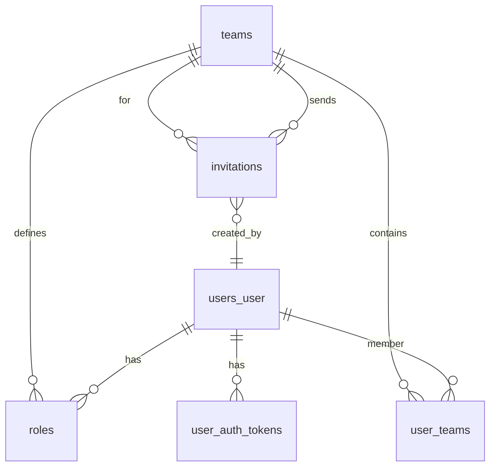

# HR Tech Django — документация

Документ фиксирует текущее состояние проекта без будущих планов.

## 1. Обзор
Проект на Django 4.2 с кастомной моделью пользователя (email как логин) и Bearer-token аутентификацией через `UserAuthToken`. Основные модули: `users`, `teams`, `invitations`. База данных по умолчанию — SQLite. В моделях используется soft-delete через поле `deleted_at`. Код типизирован и следует PEP8.

## 2. Структура проекта
```
hrtech/            # базовые настройки, профили окружений
modules/
  users/           # кастомный пользователь, токены, авторизация
  teams/           # команды, роли, членство
  invitations/     # приглашения в команды
requirements/      # зависимости
manage.py
```

## 3. Установка и запуск
1) Установить зависимости: `pip install -r requirements/local.txt`
2) Создать файл `hrtech/env/.env` с ключами минимум:
   - `ENV_ID=local`
   - `SECRET_KEY=<django-secret>`
3) Выполнить миграции: `python manage.py migrate`
4) Запустить сервер: `python manage.py runserver`
5) Проверить конфигурацию: `python manage.py check`

Окружение выбирается переменной `DJANGO_SETTINGS_MODULE`:
- Локально: `hrtech.env.local`
- Прод: `hrtech.env.prod`

## 4. Аутентификация и авторизация
- Точка входа для токена: `POST /v1/users/token` (email + password). Возвращает bearer-токен (UUID) и `created_at`.
- Все защищённые эндпоинты требуют заголовок `Authorization: Bearer <token>`.
- Кастомный authentication класс: `modules.users.authentication.BearerTokenAuthentication`.
- Кастомное разрешение: `modules.users.permissions.IsBearerAuthenticated`.
- При новом логине все предыдущие токены пользователя помечаются удалёнными (revocation).
- Права внутри команды задаются ролями (`Role`) и флагами в `UserTeam` (`has_permission_manage_users`, `has_permission_manage_projects`).

## 5. Модели (ключевые поля)
### User (users_user)
- `id` UUID PK, `email` unique (USERNAME_FIELD), `first_name`, `last_name`, `birth_date`, `phone`, `faculty`, `clothes_size`, `city`, `admission_year`, `telegram_nick`
- Служебные: `is_active`, `is_staff`, `deleted_at`, `created_at`, `updated_at`
- Связи: M2M с Team через `UserTeam`, FK с Role

### UserAuthToken (user_auth_tokens)
- `id` UUID PK, `user` FK -> User, `token` уникальный текст, `created_at`, `deleted_at`

### Team (teams)
- `id` UUID PK, `name`, `educational_institution_type`, `city_id`, `university_id`, временные метки, `deleted_at`

### Role (roles)
- `id` UUID PK, `user` FK -> User, `team` FK -> Team (nullable), `role` (choices), временные метки, `deleted_at`

### UserTeam (user_teams)
- `id` UUID PK, `user` FK -> User, `team` FK -> Team, флаги доступа, временные метки, `deleted_at`
- Constraint: уникальность пары (user, team)

### Invitation (invitations)
- `id` UUID PK, `team` FK -> Team, `email`, `token` UUID unique, `single_use`, `status` (pending/accepted/cancelled)
- Флаги капитана/прав, `created_by` FK -> User, временные метки, `deleted_at`

### ER-диаграмма (Mermaid)


## 6. API v1
Все эндпоинты, кроме публичных приглашений, требуют `Authorization: Bearer <token>`.

### Users
- `POST /v1/users/token`
  - Body: `{ "email": "user@example.com", "password": "secret" }`
  - 200: `{ "auth": {"token": "uuid", "created_at": "..."}, "user": {...} }`
  - Ошибки: 401 (неверные креды), 404 (пользователь не найден), 403 (пользователь неактивен)

- `GET /v1/users/me`
  - Возвращает текущего пользователя и метаданные токена.

- `PATCH /v1/users/me/update?team_id=<uuid>`
  - Частичное обновление профиля и ролей для указанной команды.
  - 400 при отсутствии `team_id` или ошибках данных.

- `GET /v1/users?team_id=<uuid>&page=<int>`
  - Список пользователей команды. Без `team_id` возвращает пустой список.

- `GET /v1/users/<uuid>`
  - Детали пользователя по id.

- `DELETE /v1/users/<uuid>?team_id=<uuid>`
  - Удаляет пользователя из команды (soft-delete связи). Требуются права: роль captain/vice-captain или флаг `has_permission_manage_users` у текущего пользователя.

### Teams
- `GET /v1/teams` — список команд (без удалённых).
- `GET /v1/teams/<uuid>` — детали команды.
- `POST /v1/teams` — создание команды (`name`, `educational_institution_type`, `city_id`, `university_id`).

### Invitations
- `POST /v1/teams/<team_id>/invitations`
  - Требуется Bearer. Body: `email`, опционально `single_use`, `is_captain`, `has_permission_manage_users`, `has_permission_manage_projects`.
  - Возврат: приглашение и `inviteUrl` (используется `FRONTEND_URL`, по умолчанию `http://localhost:5173`).

- `GET /v1/teams/<team_id>/invitations`
  - Список приглашений по команде (Bearer).

- `GET /v1/invitations`
  - Все приглашения текущего пользователя, опционально фильтр `team_id` (Bearer).

- Публичные:
  - `GET /v1/invitations/<token>` — приглашение по токену без проверки статуса.
  - `GET /v1/invitations/<token>/check-user` — проверка, существует ли пользователь с email приглашения.
  - `POST /v1/accept` или `/v1/invitations/accept` — принять приглашение: `{ "token": "<invitation-token>" }`.
  - `POST /v1/invitations/<token>/register` — регистрация по приглашению: `email`, `password`, `first_name`, `last_name` (camelCase поддерживается для имён).
  - `PATCH /v1/invitations/<id>/cancel` — отмена приглашения (Bearer).

## 7. Форматы ошибок
Пример:
```json
{ "detail": "Invalid token" }
```
Статусы: 400 (валидация/бизнес-ошибка), 401 (нет/неверный токен), 403 (нет прав), 404 (не найдено).

## 8. Документация API
В коде подключена общая DRF-конфигурация с кастомной аутентификацией. Автогенерация Swagger/Redoc не настроена; схема OpenAPI и UI не публикуются.

## 9. Фильтрация и оптимизация
- Репозитории используют `select_related`/`prefetch_related` для ролей и команд.
- GET `/v1/users` фильтрует по `team_id` и возвращает пустой список при его отсутствии.

## 10. Тестирование
Автоматические тесты в репозитории присутствуют частично (например, `modules/users/tests/users_tests.py`). Полное покрытие каждого эндпоинта 1 good + 3 bad кейсами не реализовано. Запуск существующих тестов: `python manage.py test`.

## 11. Команды управления данными
Management commands для наполнения БД отсутствуют. База заполняется через API или админку.

## 12. Стиль и типы
- Код типизирован (включая сервисы, репозитории, модели).
- PEP8 соблюдается; автоматические проверки (flake8/mypy) не подключены в зависимостях.

## 13. Поведение токенов и soft-delete
- При логине все активные токены пользователя помечаются `deleted_at` (отзыв).
- Все выборки моделей фильтруют записи с `deleted_at__isnull=True`, чтобы исключить мягко удалённые объекты.
